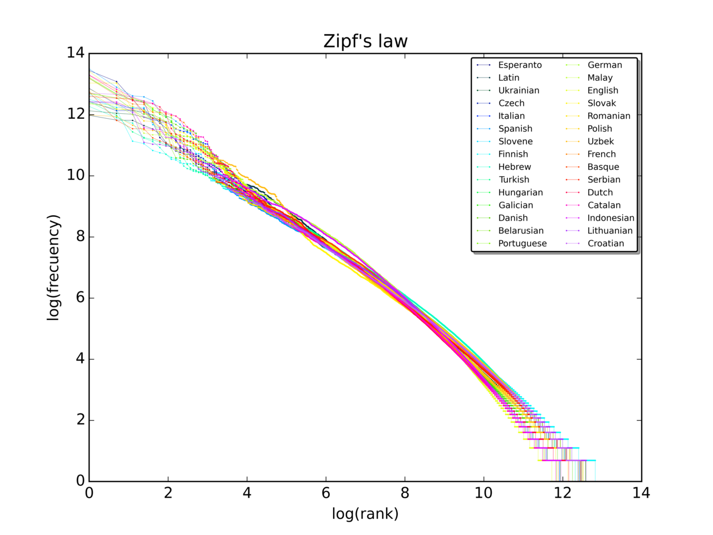
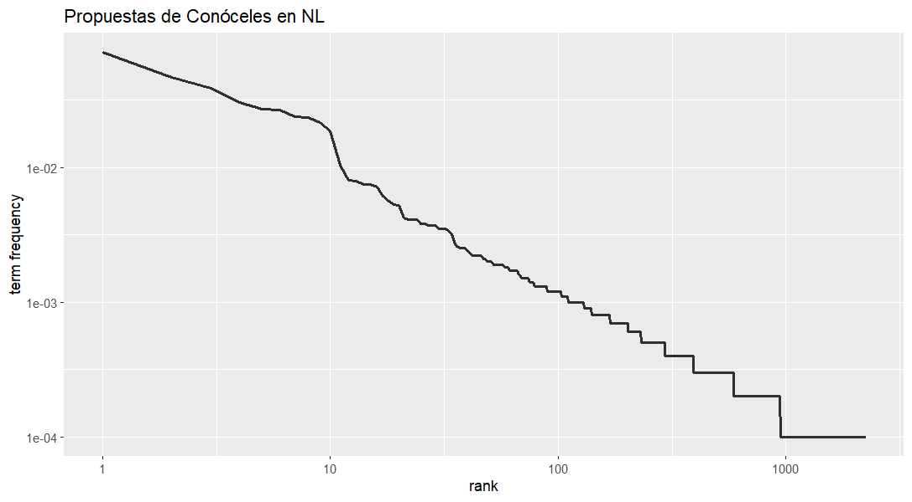

```{r setup, include = FALSE}

# load packages
library(knitr)
library(tidyverse)
library(fontawesome)
library(xaringanExtra)

# set default options
opts_chunk$set(echo = FALSE,
               fig.width = 7.252,
               fig.height = 4,
               dpi = 300)

xaringanExtra::use_tile_view()
xaringanExtra::use_panelset()
```

class: right, middle, inverse, titular
background-image: url(img/red.png)
background-size: contain
background-position: -40% 40%


# `r rmarkdown::metadata$title` 
## **`r rmarkdown::metadata$subtitle`**
### `r rmarkdown::metadata$author`
### `r rmarkdown::metadata$date`

[`r fontawesome::fa("github")` Repositorio](https://github.com/jmtoral/ciencia_datos_II)
<br>[`r fontawesome::fa("images")` Diapositivas ]()


---
name: saludo
layout: false
class: inverse, middle, left

# El plan del día de hoy

- Utilizaremos la base *Conóceles 2021* para aprender los básicos del análisis de texto.
- Limpiaremos esta tabla para hacer la útil `r emo::ji("disappointed")`
- Eliminaremos *palabras vacías* y sabremos por qué.
- Haremos conteos de los términos más frecuentes.
- Haremos conteos por grupos.


---

# 1. Invoca las biblitoecas que usamos la vez pasada

Adicionalmente, también instala (si es el caso) e invoca el paquete `janitor`.

```{r message=FALSE, warning=FALSE, echo=T}
library(tidyverse) # Un viejo conocido
library(readxl) # Porque una vida sin excel no es vida...
library(janitor) # Limpieza

library(tidytext) # Una navaja suiza para el procesamiento de texto
library(quanteda) # Herramientas poderosas de análisis de texto
library(tm) # El estándar para el trabajo de minería de texto

library(wordcloud) # Gráficas de nubes de palabras
```


---

# 2. Importa los datos que descargamos la vez pasada

Ya no es necesario descargar de nuevo el archivo, pero dejo el código para hacerlo por si es de utilidad.

```{r message=FALSE, warning=FALSE, echo=T}
# El enlace directo al .xls
url <- "https://candidaturas2021.ine.mx/documentos/descargas/baseDatosCandidatos.xls" 

#Descargar en la carpeta "datos"
download.file(url, destfile = "data/baseDatosCandidatos.xls", mode = "wb")

# Leer datos
con21 <- read_excel("data/baseDatosCandidatos.xls") #<<

```


---

# 3. Filtros y selección

Al igual que la vez pasada, utilizaremos *Nuevo León* para este ejercicio. No obstante, te invito *encarecidamente* a que selecciones otra entidad. Igual y llegas a resultados interesantes.


Adicionalmente, vamos a filtrar sólo a las personas candidatas *PROPIETARIAS*.

```{r echo=T, message=FALSE, warning=FALSE, eval=T}

con21nl <- con21 |> 
  clean_names() |> 
  filter(entidad == "NUEVO LEÓN") |> 
  filter(tipo_candidato == "PROPIETARIO") |>  #<<
  select(partido_coalicion, candidatura, distrito:nombre_candidato,
         edad, genero, propuesta_1:propuesta_genero)

```

---

# 4. ¿Quién no respondió?

Nada más para quemarles, veamos quién no llenó *ni una* propuesta.

```{r echo=T, message=FALSE, warning=FALSE, eval=T}
pereza <- con21nl |> 
  mutate(
    pereza = case_when(
      is.na(propuesta_1) & is.na(propuesta_2) & is.na(propuesta_genero) ~ "sí",
      TRUE ~ "no"
    )
  ) |> 
  filter(pereza == "sí") #<< 
```


---

# 4. ¿Quién no respondió?

Nada más para quemarles, veamos quién no llenó *ni una* propuesta.

```{r echo=F, message=FALSE, warning=FALSE, eval=T}
pereza  |> 
  select(partido_coalicion, distrito, nombre_candidato)
```


---

# 5. Pegar propuestas en una sola

Como la vez pasada, concatenaremos las 3 propuestas en una sola, pero me voy a deshacer de quienes no participaron.

```{r echo=T, message=FALSE, warning=FALSE, eval=F}
con21nl <- con21nl |> 
  filter(!num_lista_o_formula %in% pereza$num_lista_o_formula)  #<< 
```

---

# 5. Pegar propuestas en una sola

Como la vez pasada, concatenaremos las 3 propuestas en una sola, pero me voy a deshacer de quienes no participaron.

```{r echo=T, message=FALSE, warning=FALSE, eval=T}
con21nl <- con21nl |> 
  filter(!num_lista_o_formula %in% pereza$num_lista_o_formula) |> 
  mutate(prop_pasted = str_c(   #<< 
    propuesta_1, propuesta_2, propuesta_genero, sep = " ")  #<< 
    )  #<< 
```

---

# 6. *Desanidar* los tokens

Como vimos la vez pasada, desanidaremos los *tokens*. Adicional, vamos a hacer un conteo por grupos.
Me interesa que estudiemos las diferencias entre partidos políticos.

```{r echo=T, message=FALSE, warning=FALSE, eval=F}
con21nl <-  con21nl |> 
  unnest_tokens( 
    output = "palabras", 
    input = "prop_pasted", 
    token = "words" 
  ) |> 
  count(partido_coalicion, palabras, sort = T)  #<<
  
```


---

# 7. Contemos las plabras totales y únicas


```{r echo=T, message=FALSE, warning=FALSE, eval=F}

con21nl <-  con21nl |> 
  unnest_tokens( 
    output = "palabras", 
    input = "prop_pasted", 
    token = "words" 
  ) |> 
  count(partido_coalicion,palabras, sort = T) |> 
  group_by(partido_coalicion) |> #<<
  mutate(total = sum(n)) |> #Totales por partido #<<
  mutate(unicas = n()) # Únicas por partido #<<

```


---

# Proporción de únicas con respecto al total 


```{r echo=T, message=FALSE, warning=FALSE, eval=F}

pal_count_nl <-  con21nl |> 
  unnest_tokens( 
    output = "palabras", 
    input = "prop_pasted", 
    token = "words" 
  ) |> 
  count(partido_coalicion, palabras, sort = T) |> 
  group_by(partido_coalicion) |> 
  mutate(total = sum(n)) |> 
  mutate(unicas = n()) |> 
  mutate(prop_unicas = unicas/total)  #<<

```

---
class: inverse, middle, center

# 8. Ley de zipf


<div class="center">
<br>
</div>

(Obtenido de [Wikipedia](https://en.wikipedia.org/wiki/Zipf%27s_law#/media/File:Zipf_30wiki_en_labels.png))

---

# 8. Ley de zipf


.pull-left[

```{r echo=T, message=FALSE, warning=FALSE, eval=F}

con21nl |> 
  mutate(rank = row_number(), `term frequency` = n/9975) %>% 
  ggplot(aes(rank,
             `term frequency`)) + 
  geom_line(size = 1.1,
            alpha = 0.8, 
            show.legend = FALSE) + 
  labs(title=  "Propuestas de Conóceles en NL") +
  scale_x_log10() +
  scale_y_log10()

```

]

.pull-right[


<br>

]


---

# 9. Quitar las palabras vacías


```{r echo=T, message=FALSE, warning=FALSE, eval=F}

pal_count_nl <-  con21nl |> 
  unnest_tokens( 
    output = "palabras", 
    input = "prop_pasted", 
    token = "words" 
  ) |> 
  count(partido_coalicion, palabras, sort = T) |> 
  group_by(partido_coalicion) |> 
  mutate(total = sum(n)) |> 
  mutate(unicas = n()) |> 
  mutate(prop_unicas = unicas/total) |> 
  filter(!palabras %in% tm::stopwords("es"))   #<<

```


---

# 9. Las 5 palabras más frecuentes por grupo

```{r echo=T, message=FALSE, warning=FALSE, eval=T}

pal_count_nl <-  con21nl |> 
  unnest_tokens( 
    output = "palabras", 
    input = "prop_pasted", 
    token = "words" 
  ) |> 
  count(partido_coalicion, palabras, sort = T) |> 
  group_by(partido_coalicion) |> 
  mutate(total = sum(n)) |> 
  mutate(unicas = n()) |> 
  mutate(prop_unicas = unicas/total) |> 
  filter(!palabras %in% tm::stopwords("es")) |> 
  filter(!is.na(palabras)) |> 
  top_n(5, n) |> #<<
  ungroup()

```


---

# 10. Reemplazar nombres de los partidos

```{r echo=T, message=FALSE, warning=FALSE, eval=T}

pal_count_nl <-  pal_count_nl |> 
  mutate(siglas = case_when(
    partido_coalicion == "FUERZA POR MÉXICO" ~ "FxM",
    partido_coalicion == "JUNTOS HACEMOS HISTORIA" ~ "JHH",
    partido_coalicion == "MOVIMIENTO CIUDADANO" ~ "MC",
    partido_coalicion == "PARTIDO ACCIÓN NACIONAL" ~ "PAN",
    partido_coalicion == "PARTIDO DE LA REVOLUCIÓN DEMOCRÁTICA" ~ "PRD",
    partido_coalicion == "PARTIDO DEL TRABAJO" ~ "PT",
    partido_coalicion == "PARTIDO ENCUENTRO SOLIDARIO" ~ "PES",
    partido_coalicion == "PARTIDO REVOLUCIONARIO INSTITUCIONAL" ~ "PRI",
    partido_coalicion == "PARTIDO VERDE ECOLOGISTA DE MÉXICO" ~ "PVEM",
    partido_coalicion == "REDES SOCIALES PROGRESISTAS" ~ "RSP",
    TRUE ~ partido_coalicion
  ))

```


---

# Resultados

```{r echo=T, message=FALSE, warning=FALSE, eval=F}

pal_count_nl |> 
  ggplot(aes(
    x= n,
    y= reorder_within(palabras, n, siglas),
    fill = siglas
  )) +
  geom_col() +
  scale_y_reordered() +
  facet_wrap(~siglas, scales = "free") +
  guides(fill="none") +
  labs(title= "Palabras más frecuentes por partido")

```

---

# Resultados

```{r echo=F, message=FALSE, warning=FALSE, eval=T}

pal_count_nl |> 
  ggplot(aes(
    x= n,
    y= reorder_within(palabras, n, siglas),
    fill = siglas
  )) +
  geom_col() +
  scale_y_reordered() +
  facet_wrap(~siglas, scales = "free") +
  guides(fill="none") +
  labs(title= "Palabras más frecuentes por partido",
       x="Frecuencia", y= "")

```


---

# Resultados

```{r echo=T, message=FALSE, warning=FALSE, eval=F}

pal_count_nl |> 
  distinct(partido_coalicion, prop_unicas) |> 
  mutate(prop_unicas = round(prop_unicas, 2)) |> 
  arrange(-prop_unicas) |> 
  ggplot(aes(
    x = prop_unicas,
    y = reorder(partido_coalicion, prop_unicas)
  )) +
  geom_col() +
  labs(x= "Proporción únicas sobre el total",
       y= "Partidos",
       title="Proporción de palabras únicas por partido")

```


---

# Resultados

```{r echo=F, message=FALSE, warning=FALSE, eval=T}

pal_count_nl |> 
  distinct(partido_coalicion, prop_unicas) |> 
  mutate(prop_unicas = round(prop_unicas, 2)) |> 
  arrange(-prop_unicas) |> 
  ggplot(aes(
    x = prop_unicas,
    y = reorder(partido_coalicion, prop_unicas)
  )) +
  geom_col() +
  labs(x= "Proporción únicas sobre el total",
       y= "Partidos",
       title="Proporción de palabras únicas por partido")

```
