```{r setup, include = FALSE}

# load packages
library(knitr)
library(tidyverse)
library(fontawesome)
library(xaringanExtra)

# set default options
opts_chunk$set(echo = FALSE,
               fig.width = 7.252,
               fig.height = 4,
               dpi = 300)

xaringanExtra::use_tile_view()
xaringanExtra::use_panelset()
```

class: right, middle, inverse, titular
background-image: url(img/palabra.jpg)
background-size: contain
background-position: -40% 80%


# `r rmarkdown::metadata$title` 
## **`r rmarkdown::metadata$subtitle`**
### `r rmarkdown::metadata$author`
### `r rmarkdown::metadata$date`

[`r fontawesome::fa("github")` Repositorio](https://github.com/jmtoral/ciencia_datos_II)
<br>[`r fontawesome::fa("images")` diapositivas ]()


---
name: saludo
layout: false
class: inverse, middle, center

# Sobre mí


## Manuel Toral `r emo::ji("mexico")`

### Científico de datos

[`r fontawesome::fa("envelope")` jmtoral@tec.mx](jmtoral@tec.mx)
[`r fontawesome::fa("link")` manueltoral.studio](https://manueltoral.studio)
[`r fontawesome::fa("github")` @jmtoral](https://github.com/jmtoral)


---
class: left

# Acerca de ti

- Eres usuaria principiante de `R` `r emo::ji("woman_technologist_medium_skin_tone")`

--

- Conoces herramientas visualización y análisis de datos  `r emo::ji("bar_chart")`

--
- Te interesan las ciencias sociales (en partícular la ciencia política)  `r emo::ji("classical_building")` 

--

- Te gustaría trabajar en el sector público o en la interacción de éste con el sector privado `r emo::ji("woman_office_worker_medium_skin_tone")`

--

# Hoy quiero

- Dar una breve introducción sobre qué es la *minería de datos¨*
 ... y sobre por qué nos debe importar.


---

# "Minería" y otras *buzzwords*

<div class="center">

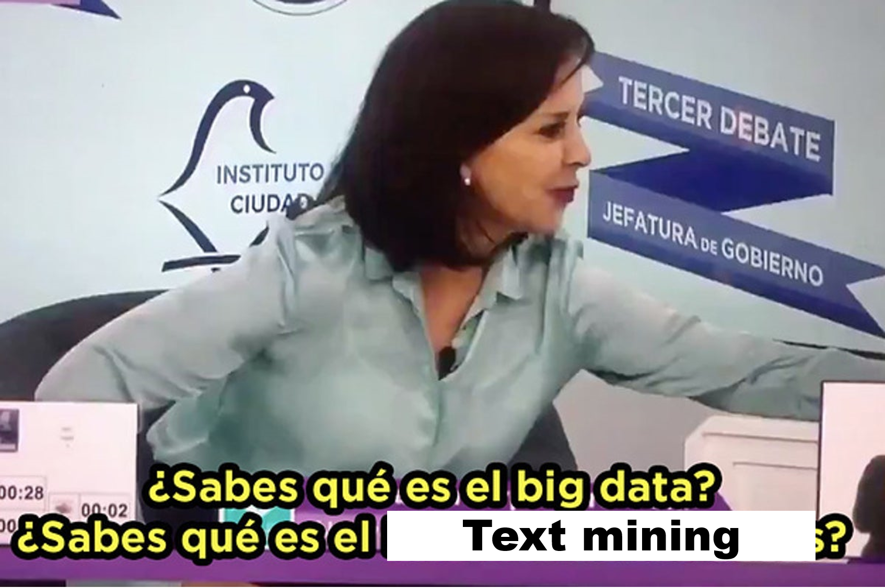<br>

</div>


---

# "Minería" y otras *buzzwords*

Con *minería* reconocemos la naturaleza no estructurada del lenguaje natural. Los patrones que existen en nuestra habla y nuestra escritura no son accesibles dee manera innmediata: **se requiere de un proceso de refinación**.


---

# ¿A qué me refieron con *refinar*?

--

.pull-left[

Pasar de esto...

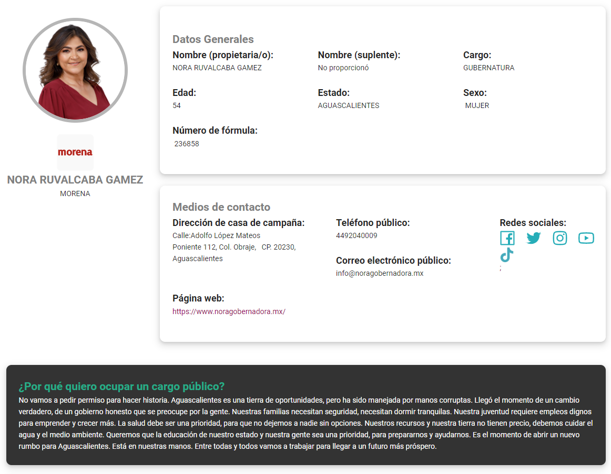<br>

]

--

.pull-right[

a esto.

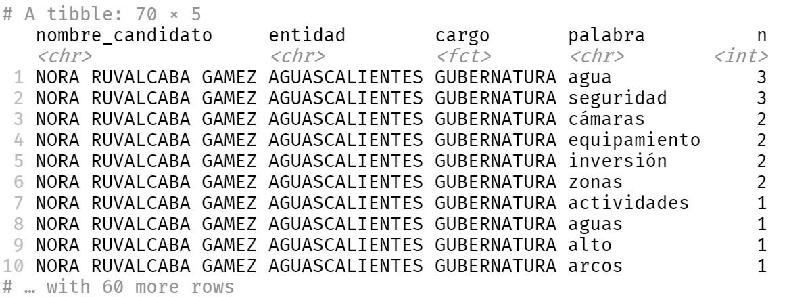<br>

]


---

# ¿Y para qué o qué?

<div class="center">

<br>

</div>

---


[**Berliner et al (2022)**](https://osf.io/nbqus/) utilizaron modelos de aprendizaje de máquina y *topic modeling* para estudiar 4.925 solicitudes de información.

<div class="center">
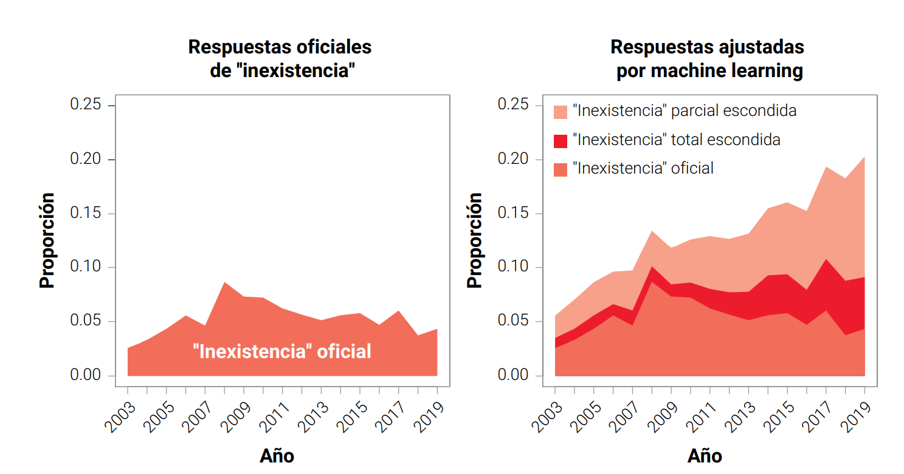<br>

</div>


---


Con base en la técnica de *modelaje de tópicos no supervisado*, las personas autoras clasificaron por temas específicos las solicitudes de información y estudiaron su comportamiento en el tiempo.

<div class="center">
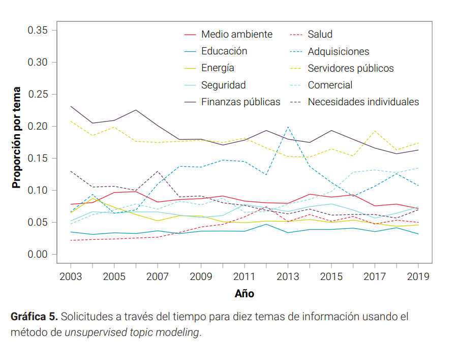<br>

</div>


---


[**Aguilar-Gómez et al (2019)**](https://www.undp.org/latin-america/publications/follow-leader-public-health-messaging-and-containment-mobility-during-pandemic) estudiaron cómo el discurso de los líderes políticos afectó el cumplimiento de las medidas de sana distancia con base en 500 conferencias matutinas de AMLO y vespertinas de López Gatell.

<div class="center">

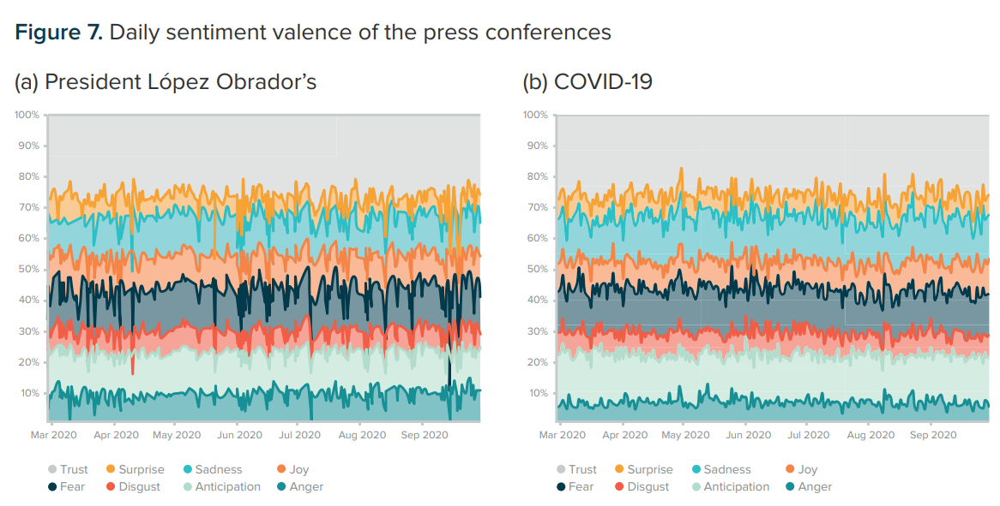<br>

</div>


---

La estrategia de las autoras fue cruzar datos de geolocalización de teléfonos móviles y las muertes relacionadas con la COVID-19 con en análisis de texto: una combinación de *modelaje de tópicos* y *análisis de sentimientos*.

<div class="center">

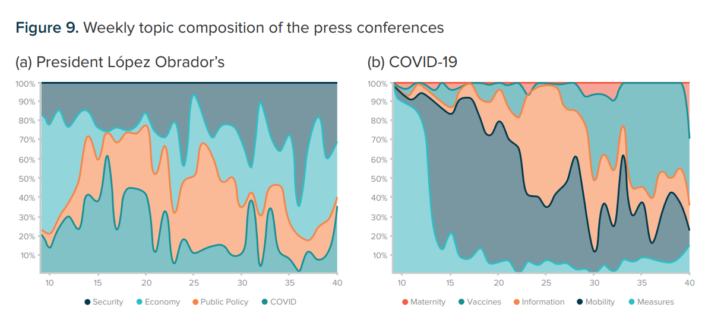<br>

</div>


---


[**Arceo-Gomez & Campos-Vazquez (2019)**](https://www.sciencedirect.com/science/article/abs/pii/S0272775719300743) estudiaron 600 mil reseñas de profesoras y profesores universitarias en el sitio *MisProfesores.com*. Las mujeres reciben sistemáticamente calificaciones más bajas, son descritas por su apariencia y son tratadas con menos respeto.

<div class="center">

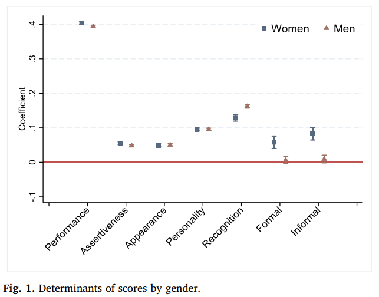<br>

</div>

---


[**Arceo-Gomez et al (2022)**](https://link.springer.com/article/10.1007/s12122-022-09331-4) estudiaron 2.5 millones de anuncios de trabajo en internet, de los cuáles 235 mil eran dirigidos a una identidad de género en particular. A las mujeres se les piden más características *comunales*: servicio, apariencia, etc.


<div class="center">

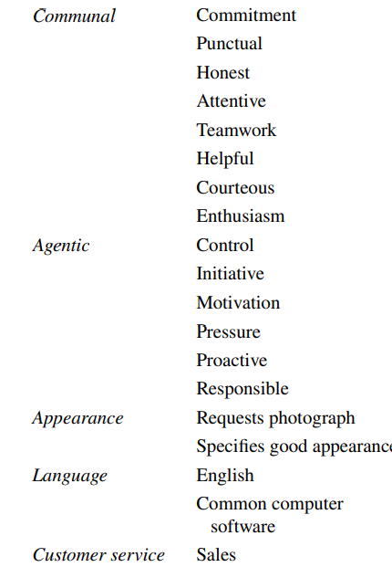<br>

</div>


---
<br> </br>

Estas diferencias entre los anuncios se traducen en peores salarios 
para las mujeres.


.pull-left[

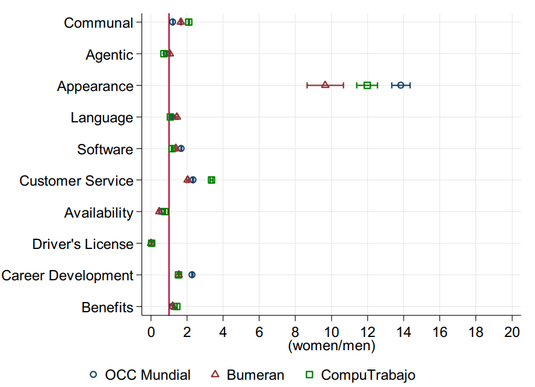<br>

]


.pull-right[

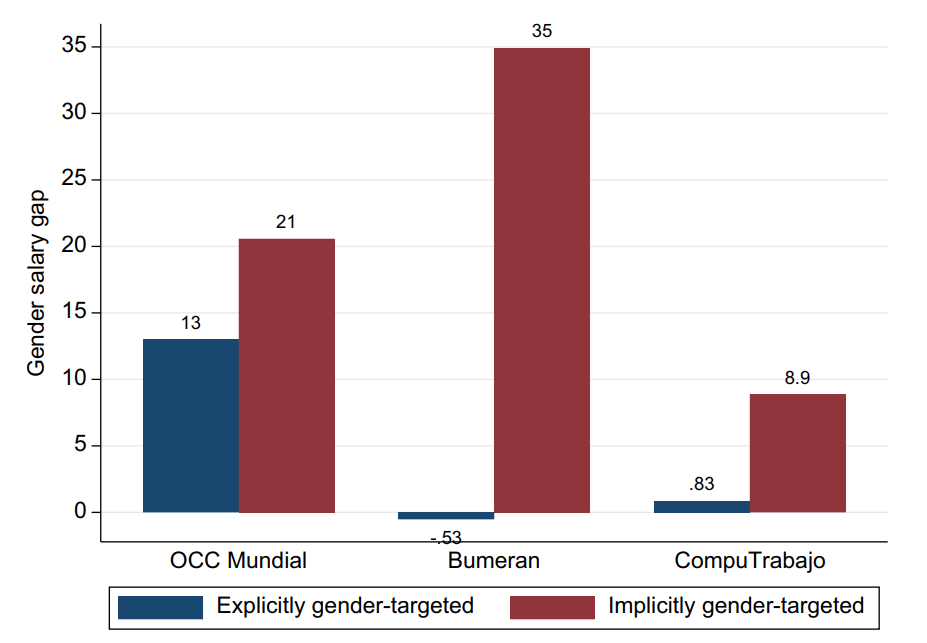<br>

]


---
<br> </br>

[**Lombana-Bermúdez et al. (2022)**](http://www.politicaygobierno.cide.edu/index.php/pyg/article/view/1494/1077) estudiaron casi 150 mil tuits de 70 mil usuarios para estudiar las cámaras de eco en redes sociales.


<div class="center">

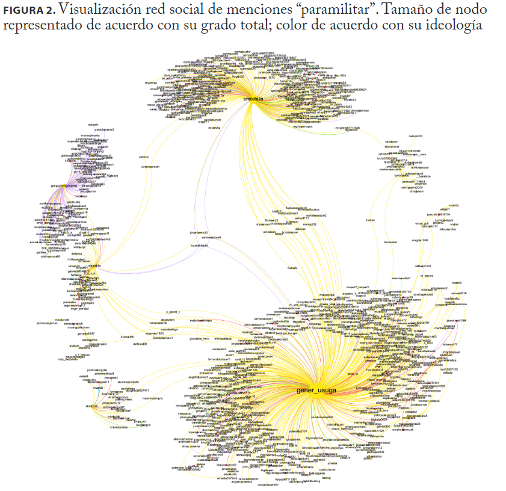<br>

</div>


---


# Manos a la obra

Vamos a hacer un breve ejercicio llamado *tokenización*. Este proceso consiste en separar nuestro texto en *tokens* y será casi siempre el primer paso para nuestro análisis de texto.

Estas son las bibliotecas que vamos a utilizar para aprender *minería de texto*. 

```{r message=FALSE, warning=FALSE, echo=T}
library(tidyverse) # Un viejo conocido
library(readxl) # Porque una vida sin excel no es vida...

library(tidytext) # Una navaja suiza para el procesamiento de texto
library(quanteda) # Herramientas poderosas de análisis de texto
library(tm) # El estándar para el trabajo de minería de texto

library(wordcloud) # Gráficas de nubes de palabras
```


---

# ¡Datos!

Vamos a descargar los datos del programa [*Conóceles 2021*](https://candidaturas2021.ine.mx/), que se compone de las propuestas de las y los candidatos que compitieron en 2021, recolectada por el INE.

```{r message=FALSE, warning=FALSE, echo=T, eval=T}
# El enlace directo al .xls
url <- "https://candidaturas2021.ine.mx/documentos/descargas/baseDatosCandidatos.xls"  #<<

```

---

# ¡Datos!

Vamos a descargar los datos del programa [*Conóceles 2021*](https://candidaturas2021.ine.mx/), que se compone de las propuestas de las y los candidatos que compitieron en 2021, recolectada por el INE.

```{r message=FALSE, warning=FALSE, echo=T, eval=T}
# El enlace directo al .xls
url <- "https://candidaturas2021.ine.mx/documentos/descargas/baseDatosCandidatos.xls" 

#Descargar en la carpeta "datos"
download.file(url, destfile = "data/baseDatosCandidatos.xls", mode = "wb")  #<<

```


---

# ¡Datos!

Vamos a descargar los datos del programa [*Conóceles 2021*](https://candidaturas2021.ine.mx/), que se compone de las propuestas de las y los candidatos que compitieron en 2021, recolectada por el INE.

```{r message=FALSE, warning=FALSE, echo=T}
# El enlace directo al .xls
url <- "https://candidaturas2021.ine.mx/documentos/descargas/baseDatosCandidatos.xls" 

#Descargar en la carpeta "datos"
download.file(url, destfile = "data/baseDatosCandidatos.xls", mode = "wb")

# Leer datos
con21 <- read_excel("data/baseDatosCandidatos.xls") #<<

```
---

# Filtros y selección

Eligamos una entidad aleatoriamente... no sé... Nuevo León. Y luego seleccionemos sólo las variables de partido, candidatura, distrito, edad, género y las propuestas. Guardaremos el resultado en un objeto llamado `con21nl`.

```{r echo=T, message=FALSE, warning=FALSE, eval=F}

con21nl <- con21 |> 
  filter(ENTIDAD == "NUEVO LEÓN" )  #<<

```

---

# Filtros y selección

Eligamos una entidad aleatoriamente... no sé... Nuevo León. Y luego seleccionemos sólo las variables de partido, candidatura, distrito, edad, género y las propuestas. Guardaremos el resultado en un objeto llamado `con21nl`.


```{r echo=T, message=FALSE, warning=FALSE, eval=F}

con21nl <- con21 |> 
  filter(ENTIDAD == "NUEVO LEÓN" ) |>
  select(PARTIDO_COALICION, CANDIDATURA, DISTRITO,  #<<
         EDAD, GENERO, PROPUESTA_1:PROPUESTA_GENERO)  #<<

```


---

# Tabla de insumo

Así queda nuestra tabla filtrada y con nuestras variables de interés.

```{r}
con21nl <- con21 |> 
  filter(ENTIDAD == "NUEVO LEÓN" ) |>
  select(PARTIDO_COALICION, CANDIDATURA, DISTRITO,  
         EDAD, GENERO, PROPUESTA_1:PROPUESTA_GENERO)   
```

```{r echo=TRUE}

glimpse(con21nl)

```

---

# Pegar propuestas en una sola

Vamos a pegar las tres propuestas: la **propuesta 1**, la **propuesta 2** y la **propuesta de género** (que en realidad se refiere a alguna propuesta *en materia de género o del grupo en situación de discriminación que representa*). Sobreescribiremos el objeto `con21nl` y eliminaremos lo sobrante.

```{r echo=T, message=FALSE, warning=FALSE, eval=F}
con21nl <- con21nl |> 
  mutate(prop_pasted = str_c(  
    PROPUESTA_1, PROPUESTA_2, PROPUESTA_GENERO, sep = " "))  #<< 
```


---


# Pegar propuestas en una sola

Vamos a pegar las tres propuestas: la **propuesta 1**, la **propuesta 2** y la **propuesta de género** (que en realidad se refiere a alguna propuesta *en materia de género o del grupo en situación de discriminación que representa*). Sobreescribiremos el objeto `con21nl` y eliminaremos lo sobrante.

```{r echo=T, message=FALSE, warning=FALSE, eval=T}
con21nl <- con21nl |> 
  mutate(prop_pasted = str_c(  
    PROPUESTA_1, PROPUESTA_2, PROPUESTA_GENERO, sep = " "))  |> 
  select(-contains("PROPUESTA_")) #<< 
```
